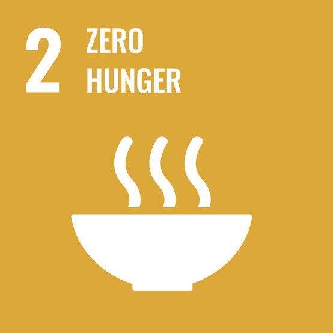
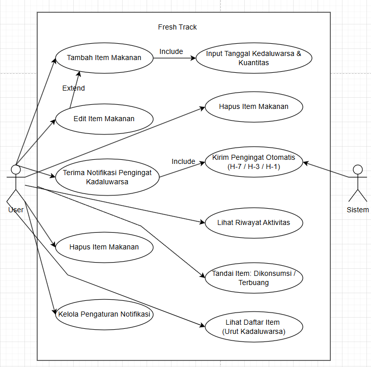
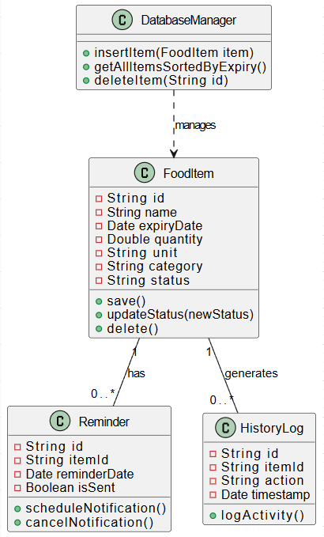
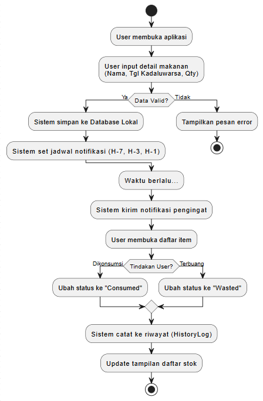

# FreshTrack

> 🥬 **FreshTrack** adalah aplikasi untuk mencatat persediaan & sisa makanan beserta **tanggal kedaluwarsa**, menampilkan **pengingat** untuk makanan yang akan segera habis masa simpannya, serta membantu pengguna menandai makanan yang **dikonsumsi** atau **terbuang** agar pengelolaan makanan di rumah lebih teratur dan efisien.

Aplikasi mobile (Expo / Android) dengan UI redesign dark/monospace dan backend Supabase (Postgres + Row Level Security) dengan autentikasi email OTP.

---

# Laporan Agile Software — FreshTrack

## 1) Informasi Proyek

**Nama proyek:** FreshTrack
**Tipe:** Mobile App (Android/iOS)
**Metode pengembangan:** Agile Scrum
**Durasi sprint:** 2 minggu
**Tools kolaborasi:** Notion, Figma, GitHub/GitLab, Google Meet/Discord

### 1.1 Tim & Peran (Scrum)

- **Product Owner (PO):** WIlson Christian
  Jobdesk: Menentukan prioritas, memegang Product Backlog, memastikan nilai produk.
- **Scrum Master (SM):** Kevin Aditya Pratama
  Jobdesk: Menjaga praktik Scrum berjalan, menghilangkan hambatan, fasilitasi event Scrum.
- **Development Team:** Luqman Alexsandro Marty Prodi, Rizky mirzaviandy priambodo
  Jobdesk: Mendesain, membangun, menguji, dan merilis Increment tiap sprint.

### 1.2 Data & Fakta

| Tema | Data (angka) | Kenapa relevan untuk FreshTrack | Sumber |
| --- | --- | --- | --- |
| **Food waste global** | **1,05 miliar ton** food waste pada **2022** (± **132 kg/kapita**), sekitar **19%** dari makanan yang tersedia untuk konsumen | Skala masalah besar; bahkan perbaikan kecil di level rumah tangga berdampak signifikan | UNEP Food Waste Index 2024 / press release |
| **Sumber food waste global** | **60%** terjadi di **rumah tangga** (sisanya: food service **28%**, retail **12%**) | FreshTrack fokus rumah tangga → menyasar sumber terbesar | UNEP Food Waste Index 2024 / press release |
| **Dampak iklim** | Food loss & waste berkontribusi **8–10%** emisi GRK global | Menguatkan urgency: bukan cuma "buang makanan", tapi juga emisi | UNEP / UN / FAO (mengutip IPCC) |
| **Indonesia — timbulan FLW** | **23–48 juta ton/tahun** (2000–2019) atau **115–184 kg/kapita/tahun** | Memberi konteks lokal: isu ini relevan di Indonesia | Bappenas (diringkas Antara) + dokumen SDGs Bappenas |
| **Indonesia — dampak ekonomi** | Kerugian **Rp213–551 triliun/tahun** (≈ **4–5% PDB**) | Menunjukkan bahwa pengurangan waste = efisiensi ekonomi rumah tangga & negara | Bappenas (diringkas Antara) |
| **Indonesia — komposisi sampah** | Sampah **sisa makanan ~41%** dari timbulan sampah (data KLHK 2022) | Menguatkan bahwa food waste dominan di sampah domestik | KLHK |
| **Perilaku konsumen: tanggal pada label** | Studi Komisi Eropa memperkirakan **hingga 10%** food waste di UE terkait **date marking** (mis. "best before" vs "use by") | Mendukung fitur pengingat & pengelolaan tanggal kedaluwarsa; "confusion" mendorong pembuangan dini | European Commission |
| **Akses data Indonesia** | Portal **SIPSN KLHK** menyediakan dataset komposisi sampah (bisa unduh Excel) | Bisa dipakai untuk chart "Indonesia waste composition" yang up-to-date | SIPSN KLHK portal |

---

## 2) Latar Belakang & Problem Statement

Di rumah tangga, pemborosan makanan sering terjadi karena stok tidak terlihat (terselip di kulkas/pantry), lupa tanggal kedaluwarsa, dan tidak adanya kebiasaan mencatat konsumsi maupun sisa yang terbuang. Ketika pengguna tidak punya sistem pengingat dan pencatatan yang rapi, keputusan "aman" yang paling mudah adalah membuang makanan. Akibatnya, belanja menjadi tidak efisien, biaya meningkat, dan sampah organik bertambah.

FreshTrack hadir sebagai solusi praktis yang fokus pada kebutuhan harian pengguna: membantu mencatat makanan yang ada, memprioritaskan mana yang perlu dihabiskan lebih dulu, serta menyediakan log sederhana untuk memahami pola konsumsi dan pemborosan. Dengan pendekatan ini, pengguna dapat membuat keputusan lebih tepat tentang makanan yang harus segera digunakan.

---

## 3) Tujuan & Indikator Keberhasilan

### 3.1 Tujuan

- Mengurangi pemborosan makanan di rumah.
- Membuat manajemen stok jadi rapi dan cepat.
- Membantu pengguna mengambil keputusan "makan dulu yang mana".

### 3.2 Aplikasi yang mirip dengan aplikasi kami

**1) UseBy**
- Fokus: **scan struk** + estimasi tanggal kedaluwarsa + reminder.
- Pembeda: input cepat lewat receipt, tapi tanggal bisa "perkiraan".

**2) Fridgely**
- Fokus: **tracker tanggal kedaluwarsa** + alert, **spaces** (fridge/pantry/freezer), bisa **share** dengan keluarga, ada barcode scan & resep.
- Pembeda: fitur kolaborasi rumah tangga dan organisasi storage.

**3) MyShelfy**
- Fokus: expiry tracker + reminders, **household sharing**, quick scan, analytics/insights.
- Pembeda: klaim core features gratis + insight konsumsi.

---

## 4) Ruang Lingkup

### 4.1 MVP

- Tambah/ubah/hapus item makanan
- Input tanggal kedaluwarsa & kuantitas
- Daftar item (urut berdasarkan kedaluwarsa)
- Pengingat untuk item yang mendekati kedaluwarsa
- Tandai item: **Dikonsumsi** / **Terbuang**
- Riwayat aktivitas dasar

### 4.2 Nice-to-have

- Barcode scan
- Sinkronisasi cloud & multi-device
- Multi-anggota rumah (shared pantry)
- Analitik limbah per kategori
- Rekomendasi menu dari stok yang ada menggunakan AI kami

---

## 5) Persona & Use Case Utama

### 5.1 Persona

1. **Karyawan sibuk (25–35)** — butuh pengingat cepat, tidak mau input ribet.
2. **Ibu/keluarga (30–45)** — banyak stok, perlu pengelompokan (kulkas/freezer/dapur) + tracking limbah.
3. **Anak kos/mahasiswa (18–24)** — suka beli banyak saat promo, sering lupa bahan di kulkas.

### 5.2 Use Case

Use Case Diagram berikut menjelaskan apa yang dapat user lakukan di aplikasi:

- **Tambah Item Makanan** = include wajib input tanggal & kuantitas
- **Edit Item Makanan** = extend dari tambah item, hanya bisa jika item sudah ada
- **Hapus Item Makanan** = menghapus item dari daftar
- **Terima Notifikasi Pengingat** = include pengiriman otomatis oleh Sistem (H-7/H-3/H-1)
- **Tandai Item: Dikonsumsi/Terbuang** = user mencatat tindakan akhir item
- **Lihat Daftar Item** = melihat stok urut kedaluwarsa
- **Lihat Riwayat Aktivitas** = evaluasi pola konsumsi & pemborosan
- **Kelola Pengaturan Notifikasi** = user kontrol aktif/nonaktif notifikasi

### 5.3 Class Diagram

Terdapat 4 Class Utama:

- **DatabaseManager** → mengelola semua operasi database (insert, get, delete)
- **FoodItem** → class inti yang menyimpan data item makanan (nama, expiry, qty, status, dll)
- **Reminder** → menjadwalkan & membatalkan notifikasi pengingat per item
- **HistoryLog** → mencatat setiap aktivitas (dikonsumsi/terbuang) beserta timestamp

### 5.4 Activity Diagram

Alur Utama:

1. User buka aplikasi → input detail makanan (nama, tanggal, qty)
2. Validasi data → jika tidak valid tampil error, jika valid disimpan ke database
3. Sistem otomatis set jadwal notifikasi H-7, H-3, H-1
4. Saat waktu tiba → sistem kirim notifikasi pengingat
5. User buka daftar item → pilih tindakan:
   - Dikonsumsi → status berubah ke "Consumed"
   - Terbuang → status berubah ke "Wasted"
6. Sistem catat ke HistoryLog → tampilan daftar stok diperbarui

---

## 6) Aturan Kerja Scrum

### 6.1 Event Scrum (ritme)

- **Sprint Planning (1–2 jam):** tentukan Sprint Goal + pilih PBI.
- **Daily Scrum (10–15 menit):** update singkat + hambatan.
- **Sprint Review (30–60 menit):** demo Increment + feedback PO/user.
- **Sprint Retrospective (30–60 menit):** evaluasi proses + action item.

### 6.2 Definition of Ready (DoR)

Sebuah item backlog siap diambil ke sprint jika: user story jelas, acceptance criteria ada, estimasi (story points) disepakati, dan dependensi diketahui.

### 6.3 Definition of Done (DoD)

PBI dianggap selesai jika: fitur berjalan sesuai acceptance criteria, kode sudah di-review, lulus testing (unit/integration sesuai kebutuhan), tidak ada bug blocker, dan ter-merge ke branch utama serta siap rilis.

---

## 7) Product Backlog

### 7.1 Daftar Epic

- **E1 — Inventory & Item Management**
- **E2 — Expiry & Reminder**
- **E3 — Consume/Waste Logging**
- **E4 — Insights & History**
- **E5 — Settings & UX**

### 7.2 Tabel Product Backlog

| ID | Epic | User Story | Priority | Story Points | Status |
| --- | --- | --- | --- | --- | --- |
| FT-01 | E1 | Sebagai pengguna, saya ingin menambah item makanan (nama, kategori, lokasi, jumlah, satuan) agar stok tercatat. | High | 5 | Todo |
| FT-02 | E1 | Sebagai pengguna, saya ingin mengubah & menghapus item agar data stok tetap akurat. | High | 3 | Todo |
| FT-03 | E2 | Sebagai pengguna, saya ingin menyimpan tanggal kedaluwarsa untuk tiap item agar bisa dipantau. | High | 3 | Todo |
| FT-04 | E1 | Sebagai pengguna, saya ingin melihat daftar item terurut dari yang paling dekat kedaluwarsa agar tahu prioritas konsumsi. | High | 5 | Todo |
| FT-05 | E2 | Sebagai pengguna, saya ingin mendapat indikator "H-7/H-3/H-1" agar tahu item mendekati kedaluwarsa. | High | 3 | Todo |
| FT-06 | E2 | Sebagai pengguna, saya ingin notifikasi pengingat berdasarkan item yang mendekati kedaluwarsa agar tidak lupa. | High | 8 | Todo |
| FT-07 | E3 | Sebagai pengguna, saya ingin menandai item "dikonsumsi" agar stok otomatis berkurang dan terekam. | High | 5 | Todo |
| FT-08 | E3 | Sebagai pengguna, saya ingin menandai item "terbuang" dengan alasan agar saya bisa evaluasi pemborosan. | High | 5 | Todo |
| FT-09 | E4 | Sebagai pengguna, saya ingin melihat riwayat konsumsi/limbah agar tahu pola penggunaan. | Medium | 5 | Todo |
| FT-10 | E1 | Sebagai pengguna, saya ingin filter berdasarkan kategori/lokasi agar pencarian item cepat. | Medium | 3 | Todo |
| FT-11 | E5 | Sebagai pengguna, saya ingin onboarding singkat agar paham cara pakai aplikasi. | Medium | 3 | Todo |
| FT-12 | E5 | Sebagai pengguna, saya ingin pengaturan jam pengingat (mis. 08:00) agar notifikasi sesuai rutinitas. | Medium | 3 | Todo |
| FT-13 | E4 | Sebagai pengguna, saya ingin ringkasan jumlah item "hampir kedaluwarsa" agar cepat bertindak. | Medium | 3 | Todo |
| FT-14 | E5 | Sebagai pengguna, saya ingin Dark Mode agar nyaman digunakan malam hari. | Low | 2 | Todo |
| FT-15 | E1 | Sebagai pengguna, saya ingin pencarian item berdasarkan nama agar tidak scroll panjang. | Medium | 3 | Todo |

### 7.3 Acceptance Criteria

**FT-01 (Tambah item)**
- Input minimal: nama item + tanggal kedaluwarsa.
- Field opsional: kategori, lokasi, jumlah, satuan, catatan.
- Validasi: tanggal kedaluwarsa tidak boleh kosong; jumlah tidak boleh negatif.
- Item baru muncul di daftar setelah disimpan.

**FT-06 (Notifikasi pengingat)**
- Pengguna bisa mengaktifkan/menonaktifkan notifikasi.
- Sistem mengirim pengingat untuk item H-7/H-3/H-1 (konfigurasi bisa menyusul).
- Mengetuk notifikasi membuka layar detail item/daftar expiry.

---

## 8) Sprint Plan (Roadmap singkat)

> Contoh 4 sprint pertama (2 minggu/sprint).

**Sprint 0 — Setup:** setup repo, branching, CI sederhana; wireframe/Figma dasar; setup penyimpanan data.

**Sprint 1 — Core Inventory (MVP 1).** Sprint Goal: pengguna bisa mencatat item + tanggal kedaluwarsa dan melihat daftar prioritas. Target PBI: FT-01, FT-02, FT-03, FT-04, FT-05.

**Sprint 2 — Reminder & Actions (MVP 2).** Sprint Goal: pengguna mendapat pengingat dan bisa menandai tindakan. Target PBI: FT-06, FT-07, FT-08, FT-12 (jika sempat).

**Sprint 3 — History & Simple Insights.** Sprint Goal: pengguna bisa melihat riwayat dan ringkasan. Target PBI: FT-09, FT-13, FT-10, FT-15.

**Sprint 4 — Polishing.** Sprint Goal: UX lebih nyaman + fitur tambahan.

### 8.1 Sprint Backlog — Sprint 1

**Sprint Goal:** *"Mencatat item makanan lengkap dengan tanggal kedaluwarsa, dan menampilkan daftar urut berdasarkan kedaluwarsa."*

PBI yang diambil: FT-01, FT-02, FT-03, FT-04, FT-05.

Breakdown task:

- [ ] Desain UI: Home (list), Add/Edit Item, Detail Item
- [ ] Model data item (nama, kategori, lokasi, qty, unit, expiry, notes, createdAt)
- [ ] Penyimpanan data (Supabase Postgres)
- [ ] CRUD item (create, read, update, delete)
- [ ] Sorting list berdasarkan expiry ascending
- [ ] Badge status expiry (H-7/H-3/H-1/Expired)
- [ ] Basic validation & empty state
- [ ] Testing minimal (fungsi CRUD & sorting)
- [ ] Demo build untuk Sprint Review

---

## 9) Cara Scrum Mengakomodasi Perubahan

Jika ada request fitur baru (mis. "Barcode Scan" atau "Dark Mode"):

1. PO menambahkan ke **Product Backlog** sebagai PBI baru (user story + acceptance criteria).
2. Lakukan **Backlog Refinement**: klarifikasi, estimasi story points.
3. PO melakukan **reprioritisasi** berdasarkan value vs effort.
4. Fitur baru diambil pada sprint berikutnya lewat **Sprint Planning**.

(Sprint yang sedang berjalan idealnya tidak diubah kecuali ada kondisi darurat dan disepakati tim.)

---

## 10) Risk Register

| Risiko | Dampak | Mitigasi |
| --- | --- | --- |
| Input user terlalu ribet → malas pakai | Adoption rendah | Form minimal, default value, template item cepat |
| Notifikasi tidak konsisten (limit OS) | Reminder gagal | Dokumentasi permission + fallback (in-app banner) |
| Data hilang saat uninstall | Kehilangan kepercayaan | Sync/backup ke Supabase (cloud) |
| Banyak variasi format tanggal/label | Bug & confusion | Validasi & format tanggal konsisten |

---

# Implementasi Teknis

Implementasi saat ini: aplikasi mobile dengan UI redesign dark/monospace di atas backend Supabase, autentikasi email OTP.

## Fitur (build saat ini)

- Login: email OTP (one-time code, tanpa password)
- Household: shared inventory per rumah tangga + kode undangan
- Catat barang: tambah/ubah/hapus batch, kuantitas, tanggal kedaluwarsa
- Tandai status: rekam jumlah dikonsumsi / terbuang + riwayat aksi (history)
- Sync: data tersimpan per-household di Supabase (Postgres + RLS)

## UI

- Tema dark/monospace: latar gelap dengan aksen emas, font Barlow + JetBrains Mono.
- `userInterfaceStyle` di-set ke `dark`; design tokens di `apps/mobile/src/theme/tokens.ts`.

## Struktur Repo

- `apps/mobile` — Expo app (Android): UI redesign + data layer Supabase
- `supabase` — Supabase backend (migrations, schema, RLS) — backend aktif untuk mobile
- `backend` — Go API backend + PostgreSQL migrations (jalur migrasi alternatif)
- `docs` — catatan arsitektur, runbook, diagram

## Prerequisites

- Node.js + npm
- Supabase CLI + Docker (untuk Supabase local: Postgres, Auth, Mailpit)
- Android Studio / Android SDK (untuk menjalankan di emulator/device)

## Menjalankan (local)

1. `supabase start` — jalankan stack Supabase local (API default di `http://127.0.0.1:54321`).
2. `cd apps/mobile && npm install`
3. Build/jalankan di emulator Android. Dari dalam emulator, Supabase local diakses lewat `http://10.0.2.2:54321` (cleartext HTTP diaktifkan via plugin `expo-build-properties`).
4. Login dengan email apa pun, lalu ambil kode OTP dari Mailpit (`http://127.0.0.1:54324`).

## Konfigurasi

- `EXPO_PUBLIC_SUPABASE_URL` — default `http://10.0.2.2:54321` (override untuk device fisik / Supabase cloud).
- `EXPO_PUBLIC_SUPABASE_ANON_KEY` — anon/publishable key.
- Default tersetel di `apps/mobile/src/lib/supabase.ts`.

## Dokumen

- `docs/architecture.md` — arah arsitektur
- `docs/runbook.md` — catatan local dev
